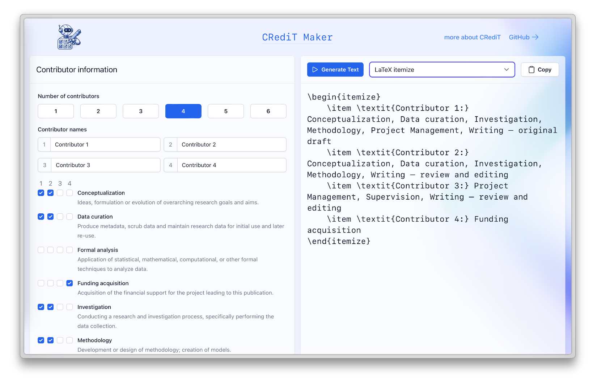

# CRediT Maker

<p align="center"></p>

CRedit Maker helps you to create CRediT (Contributor Roles Taxonomy) statements for your research papers.
To learn more about CRediT, visit the [CRediT website](https://credit.niso.org/).

<p align="center"></p>

Link to hosted version:
[https://andreas-bauer.github.io/credit-maker/](https://andreas-bauer.github.io/credit-maker/)

## Getting Started

First, install the dependencies:

```bash
npm install
```

After that, run the development server:

```bash
npm run dev
```

Open [http://localhost:3000](http://localhost:3000) with your browser to see the result.

## License

Copyright © 2024 Andreas Bauer

This work (source code) is licensed under [MIT](./LICENSE).
